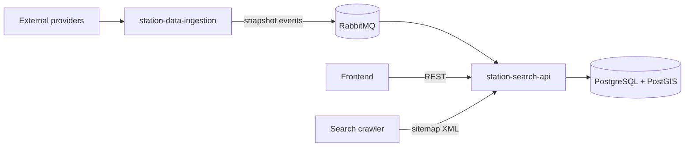
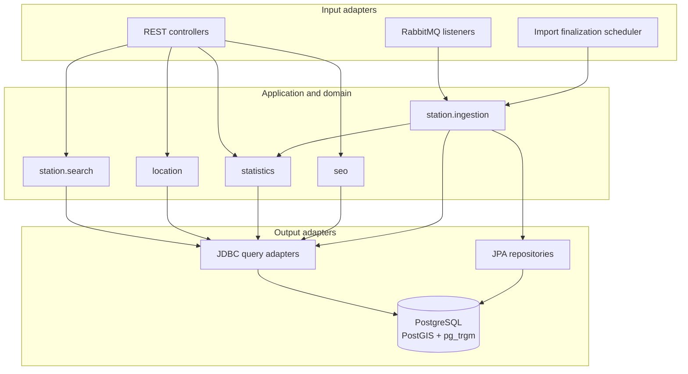
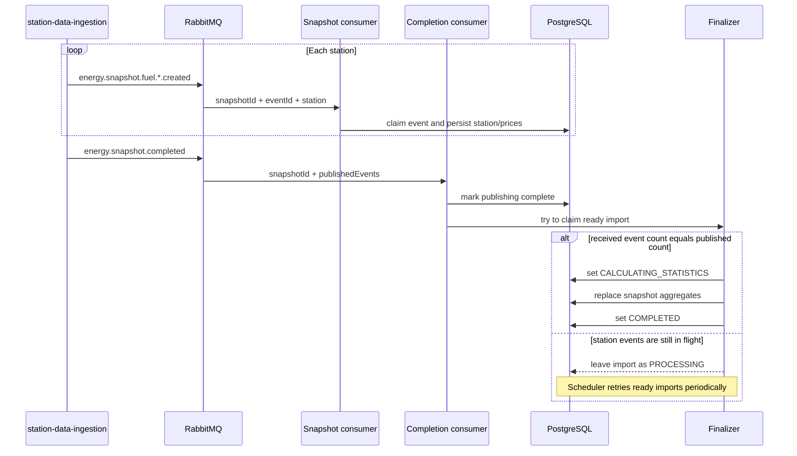
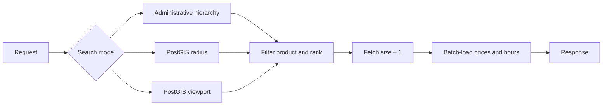
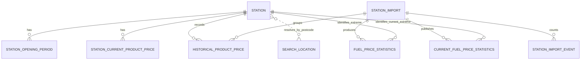

# Current `station-search-api` solution

## 1. Business view

This service owns the read model used to discover fuel stations and compare their prices. It does
not collect provider data: `station-data-ingestion` normalizes that data and publishes snapshots;
this service consumes them and exposes query-oriented REST endpoints.

### Business capabilities

| Capability | Input | Output |
|---|---|---|
| Station discovery | administrative hierarchy, radius, or map viewport | paginated stations, current prices, opening periods, and optional distance |
| Location autocomplete | country and free text | ranked locality and postal-code suggestions |
| Price intelligence | country, product, scope, and optional period | current aggregates, daily history, and locality rankings |
| Saving estimate | station, product, reference price, and tank size | saving per litre and per tank |
| SEO discovery | none or sitemap page | locations that have station or price content |

## 2. Technical architecture

The service runs on Java 21 and Spring Boot. It is a feature-first modular monolith with hexagonal
boundaries: controllers and Rabbit listeners call application use cases; output ports isolate the
JPA/JDBC persistence adapters. REST interfaces and DTOs are generated from the OpenAPI contract.

| Module | Responsibility |
|---|---|
| `station.search` | validates search modes and returns enriched station pages |
| `station.ingestion` | consumes snapshots idempotently and coordinates completion |
| `location` | normalizes input and ranks location suggestions |
| `statistics` | materializes and reads price aggregates and calculates savings |
| `seo` | builds and caches paginated sitemaps |
| `platform` | CORS, error handling, legacy parameters, and observability |

## 3. Main flows and use cases

### 3.1 Import one station snapshot event

1. The snapshot listener maps the Rabbit message to an application command.
2. `station_import` is created if the completion event has not already created it.
3. `station_import_event` claims `(snapshot_id, event_id)`.
4. Only the first delivery upserts the station and replaces its opening periods.
5. Current prices are replaced only when `observedAt` is today in UTC.
6. Prices are inserted into history with their snapshot identifier.

The claim and writes share one transaction. A duplicate delivery therefore becomes a no-op, while
a failed transaction rolls back the claim so RabbitMQ can retry it safely.

### 3.2 Complete an import and calculate statistics

The status transition to `CALCULATING_STATISTICS` is an atomic compare-and-set. It prevents the
completion consumer and scheduler from calculating the same snapshot concurrently. Messages that
exhaust configured retries are rejected without requeue and routed through the queue's DLQ policy.

### 3.3 Search stations

1. The controller builds one mutually exclusive search area: `LOCALITY`, `RADIUS`, or `VIEWPORT`.
2. The application validates coordinates, administrative input, sorting, and pagination.
3. PostgreSQL filters and ranks only station identifiers for the requested page.
4. Two batch queries load all current prices and opening periods for those identifiers.
5. The adapter assembles the response and derives `hasNext` from one extra fetched row.

### 3.4 Search locations

The input is normalized twice: as accent-insensitive text and as an uppercase alphanumeric postal
code. A single SQL statement obtains candidates from both interpretations, deduplicates localities,
and ranks exact matches before prefixes and fuzzy matches. Returned coordinates can center the map;
the administrative hierarchy can feed a subsequent `LOCALITY` station search.

### 3.5 Read statistics

- **Current:** retrieves the newest materialized aggregate for one exact administrative scope.
- **History:** returns the last aggregate of each day and 1/7/30-day absolute and percentage changes.
- **Locality ranking:** compares locality-level aggregates from one common latest snapshot.
- **Summary:** combines the current country aggregate with the aggregate at the start of a selected
  1–365 day period; its default period is seven days and its tank estimate uses 55 litres.
- **Saving:** compares a station's price from the latest completed statistical snapshot with a
  caller-provided reference price and tank size (55 litres by default).

### 3.6 Generate sitemaps

The service selects only localities backed by station or statistical content, builds canonical
location URLs, splits them into sitemap-sized pages, and returns public HTTP cache headers. The
sitemap index points to the pages when the result does not fit in one file.

## 4. Data model

| Table | Purpose |
|---|---|
| `station` | identity, address, administrative hierarchy, and geographic point |
| `station_current_product_price` | latest price per station and product for fast station search |
| `historical_product_price` | observed prices grouped by snapshot |
| `station_opening_period` | weekly opening intervals |
| `search_location` | locality, postcode, hierarchy, accuracy, and coordinates reference data |
| `station_import` | import state, expected event count, and timestamps |
| `station_import_event` | idempotency ledger and actual processed-event count |
| `fuel_price_statistics` | snapshot aggregates by product and geographic scope |
| `current_fuel_price_statistics` | latest aggregate snapshot per country for bounded current reads |

## 5. Database queries and design rationale

Read paths use explicit JDBC SQL because ranking, geospatial predicates, CTEs, and window functions
are easier to control and review than equivalent ORM-generated queries. All user values remain named
parameters; only fixed, application-selected SQL fragments such as join type and ordering are composed.

### 5.1 Station search: filter first, hydrate second

The first query has three stages:

1. **`candidate_stations`: geographic reduction**
   - `LOCALITY` matches country plus all three normalized administrative levels. A `LEFT JOIN
     LATERAL` resolves missing station metadata from the best `search_location` row with the same
     normalized postcode. The lateral lookup is restricted to the requested hierarchy to avoid a
     postcode shared by different administrative areas selecting the wrong place.
   - `RADIUS` uses `ST_DWithin` to filter in metres and `ST_Distance` to calculate the displayed
     distance. Both operate on `geography`, which gives earth-distance semantics and can use the
     GiST geospatial index for candidate filtering.
   - `VIEWPORT` uses `ST_Intersects` with an envelope. When `west > east`, the viewport crosses the
     antimeridian, so it is represented by two envelopes instead of treating it as empty.
2. **`filtered_prices`: product semantics**
   - With `productType`, filtering happens in this CTE and an `INNER JOIN` excludes stations that do
     not sell that product.
   - Without it, a `LEFT JOIN` keeps stations without known prices. `MIN(price)` supplies one sortable
     value per station and `NULLS LAST` keeps unknown prices after priced stations.
3. **`ranked_stations`: stable page**
   - Results are grouped per station, then ordered by price or distance. `id` is the final tie-breaker
     so repeated requests have deterministic ordering.
   - The query requests `size + 1` rows. The extra row yields `hasNext` without an additional
     `COUNT(*)`, which would repeat the geospatial and price work.

After paging, one `IN (:stationIds)` query loads prices and another loads opening periods. This
**three-query shape** avoids both an N+1 query per station and a large join that would multiply every
price by every opening period before pagination.

### 5.2 Location autocomplete: combine exact and fuzzy intent

The location statement is decomposed into CTEs:

1. **`unambiguous_station_localities`** maps a postcode to a station locality only when all stations
   at that postcode agree. This improves labels without guessing in ambiguous postcodes.
2. **`postal_suggestions`** applies a normalized postcode prefix. Exact postcode matches receive the
   highest priority.
3. **`ranked_localities`** accepts a normalized name prefix or the `pg_trgm` similarity operator.
   `ROW_NUMBER` keeps one representative per country, normalized locality, and full hierarchy;
   station-backed and higher-accuracy rows win.
4. **`combined_suggestions`** uses `UNION ALL`, because the suggestion type is meaningful and global
   deduplication would add work without removing the locality-level duplicates already handled.
5. Final ordering is exact postcode, exact locality, prefix, then fuzzy score and name, followed by
   the requested `LIMIT`.

### 5.3 Statistics materialization: spend once, read cheaply

Statistics are calculated after all advertised snapshot events are present:

1. Existing rows for the snapshot are deleted, making recalculation replaceable rather than additive.
2. **`source`** joins positive historical prices to stations. A lateral postcode lookup fills missing
   locality metadata; similarity to the station locality and source accuracy select the best row.
3. **`scopes`** uses `UNION ALL` to project every observation into each available level: country,
   exact locality, administrative level 1, level 2, and level 3.
4. One `GROUP BY` calculates average, minimum, maximum, station count, and calculation timestamp.
5. Ordered `ARRAY_AGG(...)[1]` selects the cheapest and most expensive station. Station ID breaks
   price ties deterministically.

This deliberately denormalizes aggregates into `fuel_price_statistics`: ingestion does more work,
but REST reads avoid scanning and grouping the full price history on every request. Keeping
`snapshot_id` on every aggregate also ensures comparisons use internally consistent source data.
After calculating a snapshot, ingestion atomically promotes it to `current_fuel_price_statistics`
when it is not older than the published snapshot for that country. That table therefore remains
bounded to one complete snapshot per country, while `fuel_price_statistics` is retained because the
history and summary endpoints use its daily aggregates. Backfills cannot replace newer current data.

### 5.4 Current statistics

1. **`selected`** gets the country/product row matching the exact requested scope from the bounded
   `current_fuel_price_statistics` table. `NULL`
   means that level is not part of the scope; normalized comparisons make names accent-insensitive.
2. **`country_statistics`** reads the country baseline from the *same snapshot*.
3. **`admin_area_2_statistics`** optionally obtains the level-2 baseline from that snapshot.
4. The final query joins the cheapest and most expensive stations to return identity, brand, price,
   and coordinates together with differences from the baselines.

Using the selected row's snapshot instead of independently asking for each latest aggregate prevents
mixing data from different imports. No matching row, or a zero station count, becomes HTTP 404.

### 5.5 Historical statistics

1. The read starts 30 days before `from`, even though those warm-up rows are not returned.
2. `DISTINCT ON (calculated_at::date)` plus descending time keeps the last snapshot of each UTC day.
3. Window functions calculate period-wide average/minimum/maximum without a second aggregation query.
4. Self-joins at exactly 1, 7, and 30 days calculate absolute changes; `NULLIF(previous, 0)` protects
   percentage division.
5. Only requested dates are returned in chronological order.

The warm-up range allows the first returned day to have 1/7/30-day comparisons. If an exact prior
calendar day is missing, the corresponding change remains `null` rather than using a misleading
nearest observation.

### 5.6 Locality ranking, saving, and summary

- **Locality ranking:** `latest_snapshot` fixes one country baseline; `locality_metadata` chooses the
  most accurate label for each full hierarchy; `RANK` preserves equal positions for equal prices.
  Administrative parameters filter which localities participate—they do not change locality-level
  granularity.
- **Saving lookup:** the station price is joined to a country-level statistics row from its snapshot.
  This restricts the result to snapshots that reached statistics calculation instead of exposing an
  in-flight import. Application code calculates `(referencePrice - stationPrice) * tankLiters`.
- **Summary:** reuses current and history use cases rather than duplicating SQL. Variation is against
  the first available point in the requested period; if none exists, variation fields are `null`.

### 5.7 Import coordination queries

- Event claiming uses `INSERT ... ON CONFLICT DO NOTHING`; the affected-row count says whether work
  belongs to this delivery without a race-prone read-before-write.
- The completion event uses an upsert because it may arrive before any station event.
- Readiness is `COUNT(station_import_event) = published_stations`; no shared counter row is updated
  for every concurrent message, reducing contention.
- Claiming statistics is a conditional `UPDATE` from `PROCESSING` to `CALCULATING_STATISTICS`. Exactly
  one caller can update the row, providing a lightweight database lock-free ownership mechanism.

### 5.8 Sitemap content query

1. One branch finds localities with stations by country and normalized postcode.
2. A second branch finds localities with statistics and `station_count > 0`, matching the complete
   administrative hierarchy with null-safe equality.
3. `UNION ALL` combines both evidence sources; the outer `GROUP BY` deduplicates locations and keeps
   the newest station/statistics timestamp for sitemap `lastmod`.
4. Stable geographic ordering makes page membership deterministic between unchanged runs.

## 6. Important validation and corner cases

| Area | Behaviour |
|---|---|
| Search modes | Parameters from locality, radius, and viewport modes cannot be mixed; incomplete modes return HTTP 400. |
| Radius | Latitude/longitude ranges are validated; radius must be `1..50,000` metres. |
| Viewport | `south < north`; crossing `+180/-180` longitude is supported. Distance sort is rejected. |
| Locality | Country must be a two-letter code; all three administrative levels are required; accents and punctuation are normalized. |
| Pagination | Page is zero-based, size is `1..100`; empty pages return an empty result with page metadata. |
| Missing prices | Kept only when no product filter is requested and sorted last. Non-positive historical prices do not enter statistics. |
| Out-of-order events | Completion may arrive first; the upsert plus periodic reconciliation still finalizes the import later. |
| Duplicate events | The `(snapshot_id, event_id)` unique key makes redelivery a no-op. |
| Old snapshots | Historical prices are stored, but they do not overwrite today's current-price table. |
| Administrative gaps | Postcode reference data fills missing hierarchy where possible; unavailable levels simply cannot produce their scoped aggregate. |
| Historical gaps | Missing exact comparison days produce `null` deltas; zero prior prices produce `null` percentages. |
| Statistics input | Hierarchy must be contiguous: level 2 requires level 1, and level 3 requires levels 1 and 2. |
| Not found | Missing current statistics or station product price returns a structured 404 problem response. |

## 7. API and operations

The source of truth for parameters and schemas is `src/main/resources/openapi/station-search-api.yml`.

| Route | Purpose |
|---|---|
| `GET /stations` | locality, radius, or viewport station search |
| `GET /locations/search` | location autocomplete |
| `GET /statistics/fuel-prices/current` | current aggregate for an exact scope |
| `GET /statistics/fuel-prices/history` | daily series and changes |
| `GET /statistics/fuel-prices/localities` | locality ranking |
| `GET /statistics/fuel-prices/summary` | country summary for a period |
| `GET /statistics/fuel-prices/savings` | theoretical saving against a reference price |
| `GET /seo/sitemap.xml` and `/seo/sitemap-{page}.xml` | sitemap index/content |
| `GET /actuator/health` and `/actuator/prometheus` | health and metrics |

- **Schema:** Liquibase migrations; Hibernate validates rather than creates the schema.
- **Database extensions:** PostGIS for geography, `pg_trgm` for fuzzy matching, and `pgcrypto` for UUIDs.
- **Messaging:** topic exchange `energy.snapshot.events`, separate snapshot/completion queues, retries, and DLQs.
- **Observability:** Actuator, Prometheus, OpenTelemetry traces, and search metrics. Logs are reserved
  for completed imports, slow searches, exhausted Rabbit retries, and unexpected request failures;
  structured fields and trace/request IDs support correlation without logging every successful request.
  Trace sampling and the slow-query threshold are externally configurable. Prometheus also exposes
  slow-search counts, exhausted Rabbit retries by queue, and statistics-calculation duration by outcome.
- **Tuning:** JDBC pool, consumer concurrency/prefetch, retry policy, batch size, and sitemap TTL are
  externally configurable.
